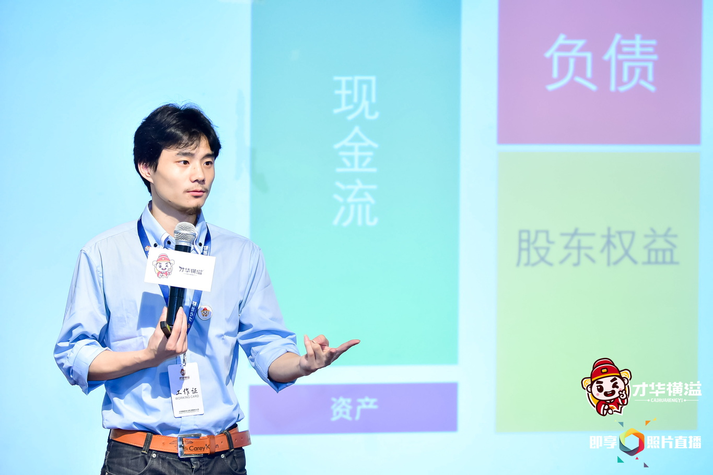
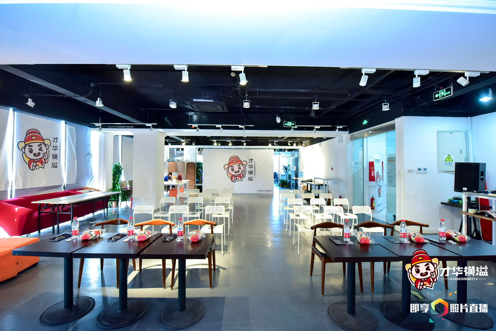
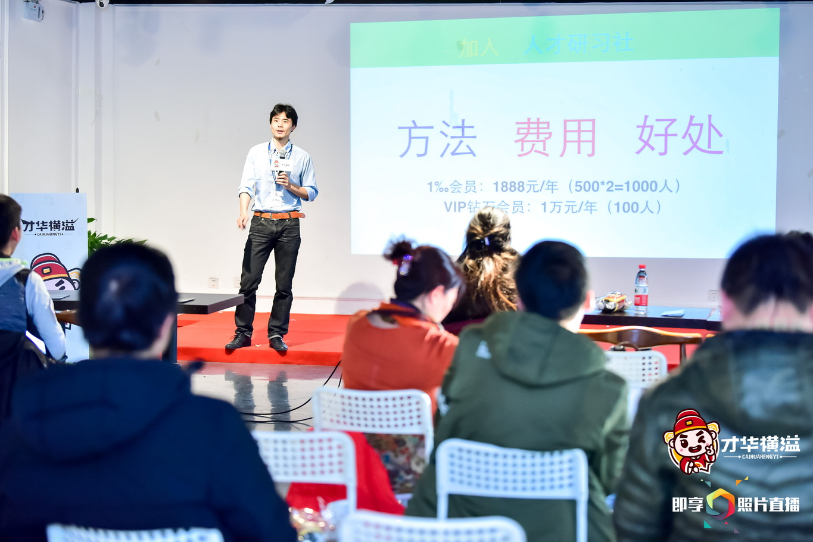

# 才华横溢
## 人才思想技能培训大纲

## 本课程总章节为88堂课。

   历时一年。
  （2016.1.1-2017.1.1）

  每个月我们上八堂课，所有课程全部是以某某力来做为开端；

  每次课时为60分钟/课时（周六、周日的晚上18:30-19:30）。

  <iframe width="720" height="350" src="http://player.youku.com/embed/XMzI5NDI2MjYyNA==" frameborder="0" allowfullscreen></iframe>

## 本课程分为三个体系：

- 职场能力课
- 技能训练营
- 千人分享会

## **第1个体系为职场能力课。**

>重点在于思维和技能的提升。

## **第2个体系为魔鬼训练营;**

>通过正确的方法和大量时间的累积，完成学员的人才培养。

## **第3个体系为千人分享会。**
>通过千人会员的自我实践成长的过程，完成名师矩阵的培养体系，完成知识人脉库的构建。

  ---

## 报名咨询：

  
  

<!--插入图片：
文字链接：[Title](你的链接地址)
图片加链接：

 !-->
